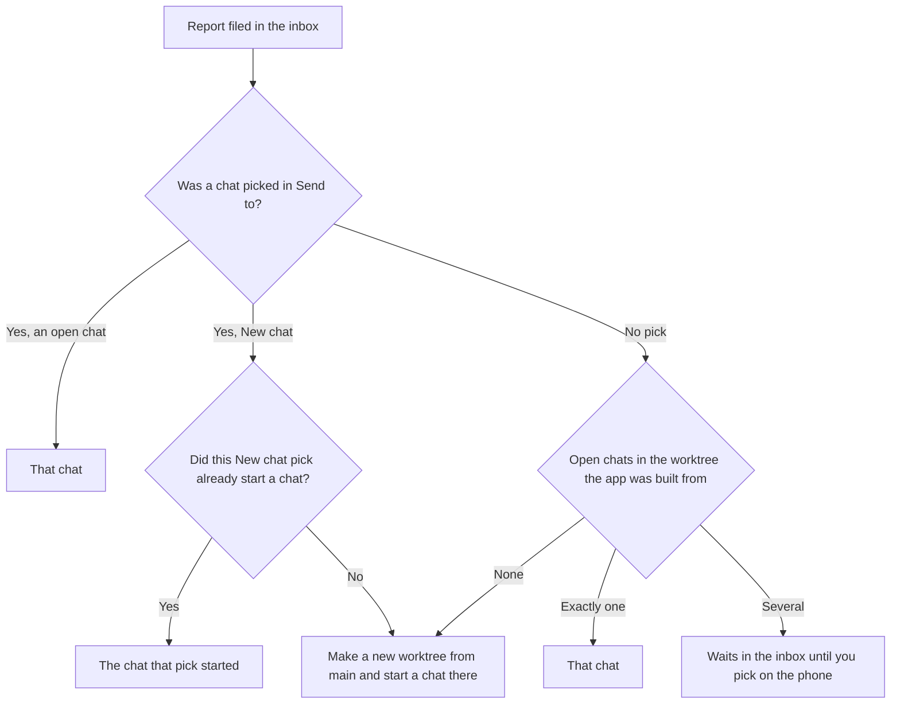

<p align="center">
  
</p>

# Redline

Redline lets you point at UI in a Debug build of your iOS app, on an iPhone or in a simulator, write a note, and send it straight into the Claude Code or Codex chat working on that app. The agent gets a snapshot of each screen with every element you noted outlined in red and numbered, plus each element's name, role and identifier from the accessibility tree, so it can find the view in the code without guessing. It is the way a designer redlines a screen, done on the running app.

It replaces the loop of taking a screenshot, moving it to the Mac, pasting it into a chat and describing which button you mean.

<p align="center">
  <picture>
    <source media="(prefers-color-scheme: dark)" srcset="docs/images/redline-hero-dark.svg">
    <source media="(prefers-color-scheme: light)" srcset="docs/images/redline-hero-light.svg">
    
  </picture>
</p>

Status: early development (version 0.1). Supported agents: Claude Code and Codex.

## Contents

- [How it works](#how-it-works)
- [What the agent receives](#what-the-agent-receives)
- [Requirements](#requirements)
- [Install on the Mac](#install-on-the-mac)
- [Add Redline to your iOS app](#add-redline-to-your-ios-app)
- [Send your first report](#send-your-first-report)
- [Using Redline](#using-redline)
- [What ships where](#what-ships-where)
- [Privacy and security](#privacy-and-security)
- [Troubleshooting](#troubleshooting)
- [Command reference](#command-reference)
- [Uninstall](#uninstall)

## How it works

The dashed arrows are setup and happen before the first report. The solid ones carry each report. The numbers match the list below.

<p align="center">
  <picture>
    <source media="(prefers-color-scheme: dark)" srcset="docs/images/redline-how-it-works-dark.svg">
    <source media="(prefers-color-scheme: light)" srcset="docs/images/redline-how-it-works-light.svg">
    
  </picture>
</p>

1. **Registers its app.** A Claude Code or Codex chat open in your app's project tells the hub which apps the project builds: Claude Code through `redline mcp`, when the chat starts, and Codex through the hook `redline setup` installs, the next time you send the chat a message.
2. **Address and token.** The hub leaves `hub.json` in the app's data container: the Mac's addresses, port 47361 and a token for that phone and app.
3. **Report.** You tap the floating button, tap elements, write notes and tap Send. The first time you send from a build, the app asks the hub which open chats work on this app, with the one in this build's worktree first, and you pick one in Send to. The kit saves the report on the device (`report.json`, `report.md` and the snapshots). An iPhone offers it to the hub with the token and uploads the files the hub asks for; from a simulator, the hub copies the finished report out of the app's folder itself.
4. **Report and snapshots.** The hub files the report in its inbox, chooses the chat, and hands it over with the path of each snapshot. A Mac notification says where it went.

### The parts

- **Redline kit** (the `Redline` Swift package). You add one line, `.redline()`, to your app's root view. In Debug builds it shows a floating button, lets you pick elements and write notes, saves each report on the device, and sends it to the Mac.
- **Redline hub** (`Redline.app`, the menu bar app). It gives each watched app on each paired iPhone the Mac's address, takes reports off phones and simulators, files them in an inbox, and hands each one to a chat. Its menu bar panel shows the active devices and the reports sent.
- **The `redline` command.** The same program, run from Terminal. Chats run it to register their app (step 1).

The hub only takes reports for apps that an open chat builds. It finds them by reading the bundle IDs of the iOS app targets in the Xcode projects (or XcodeGen `project.yml`) in each chat's folder.

### How the phone finds the Mac

Steps 2 and 3 travel differently on a physical iPhone and in a simulator:

<p align="center">
  <picture>
    <source media="(prefers-color-scheme: dark)" srcset="docs/images/redline-phone-and-simulator-dark.svg">
    <source media="(prefers-color-scheme: light)" srcset="docs/images/redline-phone-and-simulator-light.svg">
    
  </picture>
</p>

- **iPhone.** An app cannot find the Mac on its own, so the hub leaves the address in the app's folder over Xcode's device link (`devicectl device copy to`). The address lists the Mac's IPv4 addresses on Wi-Fi and Ethernet (not VPN links) and its `.local` name, port 47361, the phone's ID and a token for that phone and app. The hub writes it once, and again only when the Mac's address changes. It looks again for newly paired phones and newly installed apps every 30 minutes, when a chat for a new app opens, and when the Mac's network changes.
- **A phone that can't be reached** (asleep, out of range, on another network) is tried again after 30 seconds, then after waits that double up to 5 minutes. The hub also watches for the announcement a phone makes on the network when it wakes, and tries again right away.
- **Simulator.** A simulator app's files are ordinary files on the Mac, so the hub watches them with file system events. No network or `devicectl` is involved in sending.

### Which chat gets the report

This is step 4 in detail.



- **The phone's Send to pick comes first.** The first time you send from a build, the phone asks the Mac for the open chats that work on this app and shows them. The chat working in the worktree the app was built from is selected for you and tagged "This build". Your pick is kept for later reports from builds of the same worktree.
- **Otherwise, the chat in the worktree the app was built from.** `.redline()` records the path of the source file that calls it at compile time. The hub walks up from that path to the folder holding `.git`, and looks for an open chat whose folder is in that same worktree.
- **New chat** makes a new git worktree on a branch named `report/<report ID>`, from the repository's main branch (origin's default branch, fetched first, or else a local `main` or `master`), and starts a chat there. Later reports sent with the same pick go to that chat while its worktree exists. Picking New chat again starts another one. If no chat works in the worktree and nothing was picked, the hub also starts a new chat, with the first agent installed.
- **New chats start read-only.** The hub starts them with the agent's command line, Claude Code in plan mode and Codex in a read-only sandbox, then opens the chat in the Claude app or the Codex app, or in Terminal when that app is not installed.

### How the chat receives it

- **Claude Code.** The report goes in through the chat's own message socket and starts a turn, even when the chat is idle. If the chat has closed, the hub resumes it with `claude --resume`, in the Claude app when it is installed or else in Terminal, then sends the report.
- **Codex.** The report starts a turn through the Codex app, with its snapshots attached the way the app attaches a screenshot you add. If no Codex window has the chat open, the hub opens it first. If the app can't take it, the report goes in with your next message in that chat, through the hook `redline setup` adds. The Codex app's socket is the app's own, not a published interface, so a Codex update can change it; the hook is the fallback.

## What the agent receives

The snapshot at the top shows the first screen of this report. Each snapshot is named by its full path, followed by the notes on it. The numbers match the red outlines in the snapshot. Each note names the element by its accessibility label (or identifier), then its role and identifier:

```text
UI report from Alex's iPhone · Sample Notes

/Users/alex/Library/Application Support/Redline/inbox/com.example.notes/20261004-142233-0E12001C/screen-1.jpg
1. Save (Button, editor.save): The button sits under the keyboard on small phones
2. Title (Text field, editor.title): Placeholder is hard to read in dark mode

/Users/alex/Library/Application Support/Redline/inbox/com.example.notes/20261004-142233-0E12001C/note-3.jpg
3. Image from Photos: This is how it looked in the last build
```

The report folder also holds:

- `report.md`: a summary for the agent: the app and version, the device and iOS version, each screen's notes, and which snapshot shows each note.
- `report.json`: the same in full: each element's frame, role, label, value, identifier and class, the bigger elements that hold it, and where its outline sits in its snapshot.
- The snapshots: `screen-1.jpg` and so on, one per screen with every note on it outlined. A screen you scrolled while noting is stitched into one tall snapshot; one taller than about two screens is cut between rows into `screen-1-part-2.jpg` and so on. Attachments are `note-<number>.jpg`.

A chat that calls the MCP tool `check_messages` gets `report.md` with the snapshots attached instead.

## Requirements

- A Mac with macOS 15 or later.
- Xcode 16 or later (the package uses Swift tools 6.0, and the hub uses Xcode's `devicectl`). Redline has been built and tested with Xcode 27 only. Select Xcode with `xcode-select` if you have more than one.
- Your app targets iOS 18 or later and uses SwiftUI.
- Claude Code, Codex, or both on the Mac. For Claude Code, the `claude` command must be installed and signed in: the hub uses it to start new chats.
- For a physical iPhone: the phone is paired with the Mac in Xcode (you can run builds on it), and the phone and Mac are on the same local network.

## Install on the Mac

There is no installer yet. These steps build Redline from source.

1. **Clone the repository.**

   ```sh
   git clone https://github.com/mericksters13/agent-redline-ios.git
   cd agent-redline-ios
   ```

2. **Build and install the menu bar app.** This builds `Redline.app` and installs it in `~/Applications`. Keep that location: chats look for the app there to start it.

   ```sh
   scripts/build-hub-app.sh
   ```

   The script signs the app with your Mac's Apple Development certificate when you have one, and ad hoc otherwise. If a copy of Redline is running, the script stops it and opens the new one.

3. **Open Redline.** A Redline icon appears in the menu bar. macOS asks once whether Redline may show notifications.

   ```sh
   open ~/Applications/Redline.app
   ```

4. **Install the `redline` command.** Build it and copy that binary onto your `PATH`. Do not copy the executable out of `Redline.app`: macOS stops a copy taken out of the signed app bundle.

   ```sh
   swift build -c release --product redline
   mkdir -p ~/.local/bin
   cp "$(swift build -c release --show-bin-path)/redline" ~/.local/bin/redline
   ```

   If `~/.local/bin` is not on your `PATH`, add it, or use the full path in the next steps.

5. **Run setup** with the installed copy. Hooks are written with the path of the command that runs setup.

   ```sh
   ~/.local/bin/redline setup
   ```

   What it does:
   - **Claude Code first.** If Claude Code is used on this Mac, setup checks the `claude` command. If it is missing, setup prints the install command and stops. If the Claude app is installed and `claude` is older than 2.1.285, it runs `claude update`. If `claude` is not signed in, it runs `claude auth login` in your terminal. The `claude` command has its own sign-in, separate from the Claude app's.
   - **Codex.** It adds one hook, on `UserPromptSubmit`, named "Report delivery", to `~/.codex/hooks.json`. Your other hooks stay as they are, and the file is backed up once as `hooks.json.before-redline`.
   - Claude Code needs no hooks. When `~/.claude` exists, setup still rewrites `~/.claude/settings.json` in place (keys sorted, pretty-printed) and backs it up once as `settings.json.before-redline`, without adding anything. Running setup again changes nothing.

6. **Trust the Codex hook.** Codex runs a new hook only after you trust it. In Codex, open `/hooks` and trust "Report delivery".

7. **Add the MCP server to Claude Code.** Each Claude Code chat then runs `redline mcp`, which registers the chat and the apps its project builds with the hub, and opens Redline when it is not running. In projects that build no iOS app it does nothing.

   ```sh
   claude mcp add --scope user redline -- "$HOME/.local/bin/redline" mcp
   ```

   It also gives the chat two tools, `check_messages` and `wait_for_message`, for taking reports that are waiting in the inbox.

## Add Redline to your iOS app

1. **Add the package.** In Xcode, choose File > Add Package Dependencies and enter:

   ```text
   https://github.com/mericksters13/agent-redline-ios.git
   ```

   There are no version tags yet, so choose the `main` branch.

2. **Add the `Redline` library to your app target** when Xcode asks which product to add. In a `Package.swift`, the dependency is:

   ```swift
   .package(url: "https://github.com/mericksters13/agent-redline-ios.git", branch: "main")
   // in the app target's dependencies:
   .product(name: "Redline", package: "agent-redline-ios")
   ```

   In an XcodeGen `project.yml`:

   ```yaml
   packages:
     Redline:
       url: https://github.com/mericksters13/agent-redline-ios.git
       branch: main
   targets:
     YourApp:
       dependencies:
         - package: Redline
           product: Redline
   ```

3. **Add one line to your root view.**

   ```swift
   import SwiftUI
   import Redline

   @main
   struct SampleApp: App {
       var body: some Scene {
           WindowGroup {
               ContentView()
                   .redline()
           }
       }
   }
   ```

That is all: no Info.plist keys, permissions, build settings or build phases. You don't need `#if DEBUG` around the call; in Release builds, `.redline()` returns the view unchanged.

On a physical iPhone, iOS asks once whether the app may find devices on the local network, the first time it talks to the Mac. Allow it, or reports can't reach the Mac.

## Send your first report

1. Make sure Redline is running on the Mac (its icon is in the menu bar).
2. Open a Claude Code or Codex chat in the app's project. A Claude Code chat registers when it starts; a Codex chat registers the next time you send it a message.
3. Build and run the Debug build from Xcode, on a paired iPhone or a simulator. The menu bar panel then shows the device as Ready (a phone) or Running (a simulator).
4. In the app, tap the floating Redline button, tap an element, write a note and tap Add note.
5. Tap Send. The first time, pick the chat in Send to and confirm.
6. The report appears in the chat, and the menu bar panel lists it with the chat it went to.

## Using Redline

### On the phone

- **The floating button.** Tap it to start marking up the screen. Drag it anywhere; it snaps to the nearest screen edge. Press and hold it to see the reports sent from this device.
- **Annotate mode.** A light red line runs around the screen while Redline has it, and the controls sit in a black bar at the top. Tap any element to select it; Smaller and Larger step to a part of it or to the bigger element around it. Write a note and tap Add note. Keep going across screens: notes collect until you send them. Tap the close button in the bar to use the app again; the notes stay.
- **Notes tray.** Tap the screen name in the bar to see the waiting notes. Tap one to see its snapshot and note full screen, or delete it. The draft is saved on the device, so it survives the app being killed or reinstalled by a rebuild.
- **Screenshots and attachments.**
  - Take a screenshot as usual. A thumbnail appears beside the floating button; tap it to write a note and send. Redline captures the app's own windows at that moment, so Redline itself is never in the snapshot.
  - In annotate mode, the capture button attaches the whole screen as it is, and the paperclip attaches images from Photos.
  - Apps that already declare Photos access in their Info.plist show a grid of recent photos, and ask for access only when you tap Show recent photos. With that access, Redline also offers screenshots taken in other apps when you come back to yours. Other apps get the system photo picker, which needs no access.
  - Notes on elements and attachments go together in one report.
- **Send to.** The row in the notes tray shows where reports go, and changes it. The picker has one tab per agent on the Mac, a New chat row ("In a new worktree from main"), and the open chats that work on this app, the one in this build's worktree first.
- **Delivery.** After Send, a short message says whether the report reached the Mac. A report that didn't is kept on the device. Once one report has reached the Mac, the app offers any it hasn't confirmed again each time the app comes back to the foreground. The sent reports list shows "On the Mac" for each report, or why it isn't there yet.

### On the Mac

Click the Redline icon in the menu bar to open the panel:

- **Header:** the address and port apps reach the Mac at.
- **Devices:** paired iPhones that are ready and running simulators with a watched app, with the time of each one's last report. Paired phones that can't take reports right now are dimmed, with the reason, such as Not reachable or No watched app installed.
- **Reports:** the 30 newest, each with its first snapshot, the device, when it arrived, the agent and chat it went to (or why it is waiting), and its first notes. Click a report to open it in a viewer window: its pictures with the numbered outlines, and its notes beside them; click a note to bring its picture into view. **Open in Claude Code** or **Open in Codex** reopens the chat the report went to, and **Show in Finder** shows the report's folder.
- **Open inbox** opens the inbox folder in Finder. **Quit** stops the hub.

Each report also posts a Mac notification saying where it went.

## What ships where

- **Debug builds only.** Every kit source file except the public modifier is compiled only when the `REDLINE` flag is set, and `Package.swift` sets it only for the Debug configuration. Release builds, including TestFlight and App Store builds, get an empty module, and `.redline()` returns the view unchanged.
- **Private API, Debug only.** SwiftUI builds its accessibility tree only when an assistive client is connected. To read element names and roles, the kit turns on the automation mode UI tests use, through the private `AXSSetAutomationEnabled` function, loaded at run time. That code is inside the `REDLINE` flag, so it is not in Release builds.
- **The Mac side never ships in your app.** `redline` and `Redline.app` are Mac-only targets in the same package. Your app links only the `Redline` library.

## Privacy and security

- **Local network only.** Redline has no server and no account. Reports go from the phone to your Mac over your local network (TCP port 47361), or from a simulator's folder on the same Mac. The connection is plain TCP, not encrypted; what guards it is the token below. The hub's one use of the internet is `git fetch` of the main branch when it makes a worktree for a new chat.
- **A token per phone and app.** The hub makes a random token for each app on each phone and leaves it, with the address, in the app's folder over Xcode's device link, which only a Mac paired with that phone can do. The hub turns down reports and chat questions that don't carry the right token. Tokens are stored in `~/Library/Application Support/Redline/hub/tokens.json`, readable only by you.
- **Where reports are kept.** On the device: `Library/Application Support/Redline` in the app's own container. On the Mac: `~/Library/Application Support/Redline/inbox`. Nothing is deleted automatically.
- **What the agent sees.** Once a report is in a chat, it is part of that chat like anything you paste in. The snapshots show whatever was on screen, so avoid noting screens with personal data you don't want in a chat.

## Troubleshooting

**The phone says "Saved on this iPhone. Couldn't reach the Mac", or the panel shows the phone as Not reachable.**
The phone is asleep, out of range, or on another Wi-Fi network than the Mac. Wake the phone and put both on the same network. The hub keeps trying (after 30 seconds, then up to every 5 minutes) and tries again as soon as a phone wakes. The report stays on the phone. Once a report from this app has reached the Mac before, the app offers the waiting ones again each time it comes to the foreground; otherwise they go with the next Send. `redline status` shows each phone's state and the addresses apps use.

**The phone says "Not on the Mac yet: no Mac has set up this app".**
The hub has not left its address in the app yet. Check that Redline is running, that a chat for the app's project is open (see [Send your first report](#send-your-first-report)), and that Xcode can reach the phone. The panel shows "No watched app installed" when the installed app's bundle ID isn't one the hub found in a chat's project.

**macOS asks whether Redline may access files in your Documents folder.**
Redline reads the project folders of your open chats to learn which app each one builds, and those folders are often in Documents. Allow it. macOS asks once, because the app is signed with your Mac's Apple Development certificate and keeps the same identity across rebuilds. Without that certificate the script signs ad hoc, and macOS may ask again after every rebuild.

**Reports never reach a Codex chat, or wait for the next message.**
Open `/hooks` in Codex and trust "Report delivery". If you installed Codex after running setup, run `~/.local/bin/redline setup` again. A Codex chat registers with the hub only when you send it a message.

**A notification says to run `claude auth login`.**
The `claude` command, which starts new Claude Code chats, is not signed in, or is too old for the Claude app. The report waits in the inbox. Run `claude auth login`, or `~/.local/bin/redline setup`, which checks both.

**A report waits in the inbox.**
The panel says why, for example when several chats work in the same worktree and none was picked. Pick a chat in Send to on the phone for the next report. To take the waiting ones, call `check_messages` in a Claude Code chat with the MCP server, or run `redline check` in the project folder.

**"Couldn't find devicectl."**
Install Xcode and select it: `sudo xcode-select -s /Applications/Xcode.app`.

The hub's log is at `~/Library/Application Support/Redline/hub/hub.log`.

## Command reference

| Command | What it does |
|---|---|
| `redline setup` | Checks the `claude` command and adds the Codex hook. |
| `redline remove` | Removes Redline's hooks. Other hooks stay. |
| `redline status` | Shows what the hub is doing, each phone's state and what's in the inbox. |
| `redline check` | Prints the reports waiting for the current project's apps and takes them. |
| `redline wait` | Waits for the next report for the current project's apps, then prints it. |
| `redline mcp` | The MCP server a Claude Code chat runs. |
| `redline hub` | The hub without the menu bar app. |
| `redline app` | The menu bar app; opening `Redline.app` does the same. |

`check`, `wait` and `mcp` take `--project <folder>`, and `--app <bundle ID>` for a bundle ID that can't be read from the project.

`hub` and `app` take `--app <bundle ID>` for an app to watch whether or not a chat is open for it.

## Uninstall

Quit Redline from its panel, then:

```sh
~/.local/bin/redline remove
claude mcp remove --scope user redline
rm ~/.local/bin/redline
rm -rf ~/Applications/Redline.app
```

Reports stay in `~/Library/Application Support/Redline` until you delete that folder. In your app, remove the `.redline()` line and the package.

## Contributing

To build, test and send a change, see [CONTRIBUTING.md](CONTRIBUTING.md). How the code is written is in [docs/CODE_STYLE.md](docs/CODE_STYLE.md).

## Acknowledgements

The kit's walk of the accessibility tree and its automation switch follow the approach of [AnnotateKit](https://github.com/Connected-Mate/AnnotateKit) (MIT).
