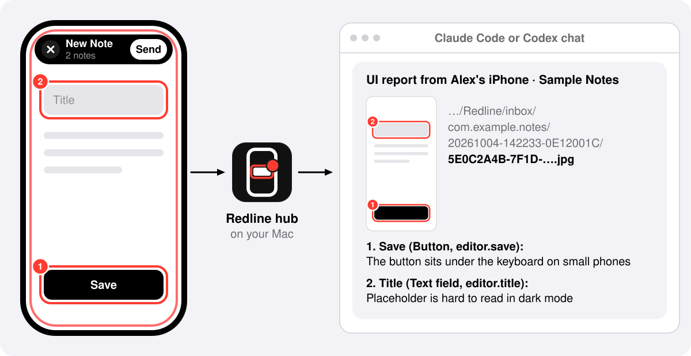

<p align="center">
  
</p>

# Redline

Redline is a SwiftUI annotation tool for agentic iOS development. Add `.redline()` to your root view, run a Debug build on a device or simulator, and tap elements to annotate them. Reports route to your Claude Code or Codex session, optionally matched by worktree. Each snapshot carries the annotation plus every annotated element's accessibility label, role, and identifier. Your agent resolves views in source instead of inferring them from contextless pixels.

<p align="center">
  <picture>
    <source media="(prefers-color-scheme: dark)" srcset="docs/images/redline-hero-dark.svg">
    <source media="(prefers-color-scheme: light)" srcset="docs/images/redline-hero-light.svg">
    
  </picture>
</p>

Version 0.1.2, early development. Works with Claude Code and Codex only.

## How it works

Redline has two parts:

- **The kit**: the `Redline` Swift package, which provides the `.redline()` modifier for your root view. It compiles into Debug builds only.
- **The Mac side**: `Redline.app`, a menu bar app (the hub in the figures), and the `redline` command. Your sessions run it as an MCP server or hook, and you run it in Terminal.

<p align="center">
  <picture>
    <source media="(prefers-color-scheme: dark)" srcset="docs/images/redline-how-it-works-dark.svg">
    <source media="(prefers-color-scheme: light)" srcset="docs/images/redline-how-it-works-light.svg">
    
  </picture>
</p>

1. **Your session registers its bundle IDs.** Redline reads them from the app targets of the Xcode project, or XcodeGen `project.yml`, in the session's working directory. It accepts reports only for registered bundle IDs, and keeps them registered after the session closes.
2. **Redline sets up the build.** It writes the Mac's address and a token to `hub.json` in the data container for the build's bundle ID. On an iPhone, it uses Xcode's device link, because a build can't find the Mac on its own.
3. **You send a report.** Tap the floating button to enter annotate mode, then tap elements, add notes and tap Send. On an iPhone, the build saves the report and sends it over the local network. On a simulator, Redline copies it out of the data container.
4. **Redline delivers it to your session.** It files the report in its inbox, then sends it with each snapshot's path.

Steps 2 and 3 on a device and on a simulator:

<p align="center">
  <picture>
    <source media="(prefers-color-scheme: dark)" srcset="docs/images/redline-phone-and-simulator-dark.svg">
    <source media="(prefers-color-scheme: light)" srcset="docs/images/redline-phone-and-simulator-light.svg">
    
  </picture>
</p>

[How Redline works](docs/HOW-IT-WORKS.md) covers when Redline scans for devices and new installs, how it chooses and reaches a session, and what each report file holds.

## What your agent receives

A report arrives in your session as a message like this one. Notes 1 and 2 match the figure at the top. Note 3 is on an attached photo.

```text
UI report from Alex's iPhone · Sample Notes

/Users/alex/Library/Application Support/Redline/inbox/com.example.notes/20261004-142233-0E12001C/5E0C2A4B-7F1D-4C39-9A0E-2B6D8F41C3A7.jpg
1. Save (Button, editor.save): The button sits under the keyboard on small phones
2. Title (Text field, editor.title): Placeholder is hard to read in dark mode

/Users/alex/Library/Application Support/Redline/inbox/com.example.notes/20261004-142233-0E12001C/C81D3F07-52B6-4E8A-B19C-6A04D7E2F915.jpg
3. Photo: This is how it looked in the last build
```

Each snapshot's path comes first, then its notes, numbered like its outlines. A note reads `Label (Role, identifier): note`. An element without a label is named by its identifier. Any named ancestors follow, such as `in Cell "Milestones" (today.list)`, so your agent can tell apart elements that share a label.

When a report goes through the Codex app, its snapshots arrive as attachments. Claude Code reads them from their paths. Each report folder also holds `report.md` with a summary and `report.json` with everything the kit read about each element, such as its frame, value and class.

## Requirements

- A Mac with macOS 15 or later.
- Xcode 26 or later.
- A SwiftUI app target with a deployment target of iOS 18 or later.
- An Xcode project or XcodeGen `project.yml` in your session's working directory. Redline reads the bundle IDs from it.
- Claude Code, Codex, or both. Claude Code also needs the `claude` command installed and signed in (see [After installing](#after-installing)).
- For an iPhone: paired with the Mac in Xcode, and on the Mac's local network.

## Install on the Mac

Install the Mac side in one of three ways. Each runs the same installer, [`install.sh`](install.sh), which builds Redline from source with your Xcode, so the first run takes a few minutes.

1. **Ask your agent.** Open your Claude Code or Codex session in your project and paste:

   ```text
   Install Redline from https://github.com/mericksters13/agent-redline-ios and add it to this app.
   ```

   Your agent follows [INSTALL.md](INSTALL.md): it adds the package to your app target and `.redline()` to your root view, builds the project, and lists what's left. It hands you one command for the Mac side, `npx agent-redline-ios`, since agent safety checks don't let an agent run an installer that changes your Mac.

2. **npx** installs the latest release. It needs Node.js 18 or later.

   ```sh
   npx agent-redline-ios
   ```

3. **curl** builds the latest `main`.

   ```sh
   (f="$(mktemp)" && trap 'rm -f "$f"' EXIT && curl -fsSL https://raw.githubusercontent.com/mericksters13/agent-redline-ios/main/install.sh -o "$f" && bash "$f")
   ```

   To build another branch, tag or commit, put `REDLINE_REF=<ref>` before `bash`.

With `--no-input`, or when a coding agent or CI runs it, the installer never prompts and lists the remaining steps instead.

### What the installer changes

The installer is safe to rerun and never runs `sudo`. When a step needs you first, such as accepting the Xcode license, it stops and prints the command. Run it, then rerun the installer.

- Installs the `redline` command in `~/.local/bin`. If that folder isn't on your `PATH`, it adds a line to `~/.zprofile` for zsh. For other shells, the checklist gives the line to add.
- Installs `Redline.app` in `~/Applications`, with a login item that launches it from there (`~/Library/LaunchAgents/com.agentredline.hub.plist`). Don't move `Redline.app`.
- For Claude Code, checks that the `claude` command is signed in and recent enough, and adds Redline's MCP server for all your projects (`claude mcp add --scope user`). In a terminal, it runs `claude update` and `claude auth login` for you when needed.
- For Codex, adds one hook, "Report delivery", to `~/.codex/hooks.json`, after backing the file up as `hooks.json.before-redline`. Your other hooks stay.
- Keeps its source and build cache in `~/Library/Caches/Redline`, and its log, reports and settings in `~/Library/Application Support/Redline`.

The MCP server and hook are no-ops in projects that build no iOS app.

The installer ends with a checklist, each item marked Done, Needs you or Skipped, and saves it to `~/Library/Application Support/Redline/install-report.txt`.

### After installing

The checklist names the steps only you can take, each with its command. The usual ones:

- **Authenticate the `claude` command** with `claude auth login`, or run `claude update` if it's too old for the Claude app. Redline uses it to start new Claude Code sessions and resume closed ones. Its sign-in is separate from the Claude app's.
- **Trust the Codex hook.** In Codex, open `/hooks` and trust "Report delivery". Codex runs a new hook only after you trust it, and Codex sessions register through this hook.
- **Open a new terminal** if the installer added `~/.local/bin` to your `PATH`.

On first launch, macOS asks whether Redline may show notifications. If your projects live in `~/Documents`, macOS also asks for access to that folder. Allow it: Redline reads each session's project folder to learn which bundle IDs it builds. If macOS reports a new background item, that is Redline's login item.

## Try the demo

[`Examples/RedlineDemo`](Examples/RedlineDemo) is an Xcode project with `.redline()` on its root view, a UIKit screen and three planted UI bugs to find. Clone this repository, open a Claude Code or Codex session in it, and run `Examples/RedlineDemo/RedlineDemo.xcodeproj` on a device or simulator. [Its README](Examples/RedlineDemo/README.md) covers device signing and what to try.

## Add Redline to your project

Add the package to your app target, then `.redline()` to your root view. If your agent installed Redline from the prompt above, it has done both.

1. **Add the package.** In Xcode, choose File > Add Package Dependencies and enter `https://github.com/mericksters13/agent-redline-ios.git`. Choose Up to Next Minor Version from `0.1.1`, and add the `Redline` library to your app target.

   In a `Package.swift`, the dependency is:

   ```swift
   .package(url: "https://github.com/mericksters13/agent-redline-ios.git", .upToNextMinor(from: "0.1.1"))
   // in the app target's dependencies:
   .product(name: "Redline", package: "agent-redline-ios")
   ```

   For XcodeGen and Tuist, see [INSTALL.md](INSTALL.md#3-add-the-package-to-the-app-target).

2. **Add `.redline()` to your root view.**

   ```swift
   import SwiftUI
   import Redline

   @main
   struct SampleApp: App {
       var body: some Scene {
           WindowGroup {
               ContentView()
                   .redline()
           }
       }
   }
   ```

The kit needs no Info.plist keys, build settings or build phases. Don't wrap the call in `#if DEBUG`: in Release builds, `.redline()` returns the view unchanged (see [What compiles into your build](#what-compiles-into-your-build)).

The first report sent from an iPhone triggers the one-time iOS local network prompt. Allow it, or reports can't reach the Mac. To set the prompt's text, add `NSLocalNetworkUsageDescription` to your Info.plist.

## Send your first report

1. Check that Redline is running: its icon is in the menu bar.
2. Open a Claude Code or Codex session in your project. Redline detects open Claude Code sessions. A Codex session registers through the hook on your next message to it, once you have trusted the hook.
3. Run a Debug build from Xcode on a device or simulator. The menu bar panel shows the device as Ready (iPhone) or Running (simulator). Redline picks up simulator installs as they happen and scans iPhones for new installs every 30 minutes. After the first install on an iPhone, click Quit in the panel and reopen `Redline.app` to scan now.
4. In the build, tap the floating Redline button, tap an element, write a note and tap Add note.
5. Tap Send. The first time, pick your session in Send to and confirm.
6. The report arrives in your session, and the menu bar panel lists it with the session it went to.

## Using Redline

### In the build

- **Floating button.** Tap it to enter annotate mode. Drag it anywhere; it snaps to the nearest edge. Press and hold it to list the reports sent from this device.
- **Annotate mode.** Routes taps to Redline instead of the build, and draws a light red border around the screen. Its controls sit in a black bar at the top.
  - Tap an element to select it. Larger selects the enclosing element; Smaller steps back toward the one you tapped.
  - Write a note and tap Add note. Notes collect across screens until you send them.
  - Tap the close button in the bar to exit annotate mode. Unsent notes stay.
- **Notes tray.** Lists unsent notes; tap the screen name in the bar to open it. Tap a note to view it full screen with its snapshot, or tap its trash button to delete it. Unsent notes persist on the device, across a killed process and a reinstall from a rebuild.
- **Screenshots and photos.**
  - Take a screenshot. A thumbnail appears beside the floating button; tap it to add a note and send. Redline captures the build's own windows at that moment, so its overlay never appears in the snapshot.
  - In annotate mode, the capture button attaches a snapshot of the whole screen, and the paperclip opens a photo panel. Without Photos access, the panel offers `PhotosPicker`, which needs no permission.
  - If your Info.plist has `NSPhotoLibraryUsageDescription`, the panel can show recent photos: tap Show recent photos to request access. With access, Redline also offers screenshots you took in other apps when you return to the build.
  - Element notes and attachments go out together in one report.
- **Send to.** The Send to row in the notes tray sets where reports go. Tap it, choose an agent, then one of its sessions that work on this bundle ID, or New chat. The picker lists open Claude Code sessions and Codex sessions used in the last 14 days. The session in the build's worktree comes first, tagged "This build", and is selected. The first Send from a worktree asks you to pick; later builds from it keep the pick. [Where reports go](#where-reports-go) explains each choice.
- **Delivery.** After Send, a toast says whether the report reached the Mac. Undelivered reports stay on the device, and the build retries them on launch, on each return to the foreground, and with the next Send. The sent reports list marks each report "On the Mac" or gives the reason it isn't there yet.

### On the Mac

Click the Redline icon in the menu bar to open the panel:

- **Devices:** paired iPhones, and running simulators with one of your builds installed, each with its last report. An iPhone that can't take reports right now is dimmed, with the reason, such as Not reachable or No watched app installed.
- **Agents:** Claude Code and Codex, whichever are installed, and whether reports can reach their sessions right now. When they can't, the row says what happens to reports meanwhile and what to do: for Claude Code, a command with a button that copies it; for Codex, open or reopen the Codex app.
- **Reports:** the 30 newest, each with its first snapshot, device, arrival time, the session it went to (or why it is waiting) and its first notes. Click one to see its snapshots and notes side by side. **Open in Claude Code** or **Open in Codex** reopens that session, and **Show in Finder** shows the report folder.
- At the bottom, **Open inbox** opens the inbox folder, and **Quit** stops Redline.

Each report also posts a macOS notification that says where it went.

## Where reports go

A report goes to the session you picked in Send to. With no pick, Redline uses the build's worktree, found from the `#filePath` that `.redline()` captures at compile time:

- **One session works there:** the report goes to it.
- **No session works there:** Redline starts a new one.
- **Several sessions work there, or the worktree isn't on this Mac**, such as for a build made on another Mac: the report waits in the inbox until a session takes it (see [Troubleshooting](#troubleshooting)).

**New sessions.** Redline creates a worktree from your repository's main branch, on a branch named `report/<report ID>`, and starts the session there. A new Codex session starts with `codex exec` in a read-only sandbox, then opens in the Codex app. A new Claude Code session opens in the Claude app and receives the report there, with your usual permission settings. Without its agent's app, a new session opens in Terminal.

- A new session starts from main, not from the build's branch. When the build's worktree isn't on main, the picker says so under New chat, such as "Built from feature/growth-card. A new chat starts from main." If the bug exists only on that branch, pick that branch's session instead.
- With no pick, Redline uses the agent you last used for this bundle ID, or else the first agent that can start a session. Picking New chat lets you choose the agent, and later reports with that pick go to the same session. Picking New chat again starts another.
- A new session needs its agent's command, `claude` or `codex`, and a main branch to start from. When no session can start, the report waits in the inbox.

**How each agent receives a report.**

- **Claude Code.** The report starts a turn in the session, even when it is idle. If the session has closed, Redline first resumes it with `claude --resume`, in the Claude app or in Terminal.
- **Codex.** The report starts a turn through the Codex app. If no window shows the session, Redline opens it first. If the Codex app isn't running or doesn't respond, the "Report delivery" hook adds the report to your next message in that session. Redline reaches the Codex app through its IPC socket, whose protocol Codex doesn't publish, so a Codex update can break this path until you update Redline. The hook keeps working meanwhile.

## What compiles into your build

- **Debug builds only.** `Package.swift` defines the kit's `REDLINE` compile flag for the Debug configuration only. Release builds, including TestFlight and App Store builds, get an empty module: `.redline()` returns the view unchanged, and your source file path isn't kept in the binary.
- **A private API, in Debug only.** SwiftUI builds its accessibility tree only while an assistive technology is connected. To read accessibility labels and roles, the kit enables the automation mode XCUITest uses, through the private function `AXSSetAutomationEnabled`, resolved with `dlsym` at run time. Release builds don't contain it.
- **No Mac code.** The `redline` executable, which `Redline.app` wraps, is a separate product in the same package. Your app target links only the `Redline` library.

## Privacy and security

- **Local network only.** Redline has no cloud service and no account. An iPhone sends reports to your Mac over your local network, on TCP port 47361. On a simulator, Redline copies them out of the data container on the same Mac. To fill Send to, Redline sends the build the sessions that work on its bundle ID (titles, folder names and last activity) and the branch of its worktree.
- **Plain TCP, with a token per iPhone and bundle ID.** The connection isn't encrypted, so others on your local network could read a report in transit. Redline generates a random token for each bundle ID on each iPhone and writes it to the data container over Xcode's device link, which only a Mac paired with that iPhone can use. Both sides prove they hold the token with an HMAC-SHA256 challenge-response, so the token itself never crosses the network. The build sends reports only to the Mac that set it up, and Redline rejects anything else. Tokens live in `~/Library/Application Support/Redline/hub/tokens.json`, with mode 0600.
- **Internet use.** Redline itself goes online only to create a worktree for a new session: it asks your repository's origin for its main branch and fetches it. Agents it starts use the network as they normally do.
- **Where reports are kept.** On the device, in the data container under `Library/Application Support/Redline`. The build keeps every report the Mac hasn't confirmed, plus the 20 newest confirmed ones. On the Mac, in `~/Library/Application Support/Redline/inbox`, never deleted automatically. A new Claude Code session also gets a copy of its report in its worktree's `.redline` folder, which git ignores.
- **What your agent sees.** A delivered report enters the session's context like any other message. Snapshots show whatever was on screen, so don't annotate screens with personal data you don't want in a session.

## Update and uninstall

### Update

Update the Mac first, then your projects. An older Redline on the Mac still delivers reports from a newer kit, but may not read them fully.

- **Mac.** Rerun your install command. It rebuilds and restarts Redline. The curl command builds the latest `main`. With npx, request `@latest`, or npx may reuse its cached copy:

  ```sh
  npx agent-redline-ios@latest
  ```

- **Project.** In Xcode, choose File > Packages > Update to Latest Package Versions, then rebuild.

### Uninstall

Run either command:

```sh
npx agent-redline-ios uninstall
```

```sh
(f="$(mktemp)" && trap 'rm -f "$f"' EXIT && curl -fsSL https://raw.githubusercontent.com/mericksters13/agent-redline-ios/main/install.sh -o "$f" && bash "$f" uninstall)
```

Uninstalling removes the `redline` command, `Redline.app`, the login item, Redline's hooks and MCP entry, the line it added to `~/.zprofile`, and its cache in `~/Library/Caches/Redline`. The checklist lists anything it couldn't remove. Other tools' hooks and MCP servers stay, as do:

- your reports, in `~/Library/Application Support/Redline`
- the `.before-redline` backups, next to the files they copied
- the worktrees and `report/` branches made for new sessions, and the line Redline added to each repository's `.git/info/exclude`

In your project, remove the `.redline()` call and the package.

## Troubleshooting

Start with `redline status` and the menu bar panel. Both show each iPhone's state and the reports in the inbox. Redline logs to `~/Library/Application Support/Redline/hub/hub.log`.

**The build shows "Saved on this iPhone. Couldn't reach the Mac".**
The build couldn't connect to Redline: Redline isn't running, the Mac is asleep or on a different network from the iPhone, or the build's Local Network access is off (turn it on in Settings > Privacy & Security > Local Network). The report stays on the iPhone, and the build retries it on launch, on return to the foreground and with the next Send. `redline status` shows the addresses builds use to reach the Mac.

**The panel shows an iPhone as Not reachable.**
Redline couldn't reach the iPhone over Xcode's device link: it is asleep, out of range or on a different network. Wake it. Redline keeps retrying, and retries immediately when the iPhone wakes.

**The build shows "Not on the Mac yet: no Mac has set up this app", or the panel shows No watched app installed.**
Redline hasn't found the build on that device yet. It picks up simulator installs as they happen. For an iPhone, it scans for new installs when it starts, when a session for a new bundle ID opens, and every 30 minutes. To scan now, click Quit in the panel and reopen `Redline.app` from `~/Applications`. If it still doesn't find the build, check that a session for the project is open (for Codex, trust "Report delivery" in `/hooks`, then send the session a message) and that Xcode can reach the iPhone.

**Annotate mode says "SwiftUI elements may not be pickable".**
The kit couldn't enable the automation mode SwiftUI needs (see [What compiles into your build](#what-compiles-into-your-build)), most likely because this iOS version removed the private function it uses. You can still select UIKit views, and the capture button still attaches a snapshot of the whole screen.

**macOS asks about your Documents folder again after you update Redline.**
The installer signs Redline with your Apple Development certificate when it can use one. Without one, Redline is signed ad hoc, so macOS may ask again after each rebuild. Allow it.

**Reports for a Codex session wait for your next message.**
The Codex app isn't installed, isn't running or doesn't respond. The Agents row in the panel says which. Open the Codex app. If it still doesn't respond after you reopen it, a Codex update may have changed how Redline reaches it: [update Redline](#update). If reports never arrive at all, open `/hooks` in Codex and trust "Report delivery". If you installed Codex after Redline, run `~/.local/bin/redline setup`.

**A notification says to run `claude auth login`.**
The `claude` command, which starts new Claude Code sessions and resumes closed ones, isn't signed in or is too old for the Claude app. The report waits in the inbox, and Redline delivers it once the command is ready. Run `claude auth login`, or `~/.local/bin/redline setup`, which checks both.

**A report waits in the inbox.**
The panel says why, for example when several sessions work in the same worktree and none was picked. Pick a session in Send to for the next report. To deliver the waiting ones, ask a session to call `check_messages` (Claude Code sessions started after the install) or to run `redline check` in the project folder.

**"Couldn't find devicectl."**
Install Xcode and select it: `sudo xcode-select -s /Applications/Xcode.app`.

## Command reference

| Command | What it does |
|---|---|
| `redline status` | Shows whether Redline is running, the bundle IDs it accepts, the addresses and port builds connect to, each iPhone's state and the inbox. |
| `redline check` | Prints the reports waiting for this project's bundle IDs. Printing claims them, so no other session receives them. |
| `redline wait` | Waits for the next report for this project's bundle IDs, then prints it. |
| `redline setup` | Checks the `claude` command and adds the Codex hook. With `--no-input`, or without a terminal, it lists the commands for you to run instead of running them. |
| `redline remove` | Removes Redline's hooks. Other hooks stay. |
| `redline mcp` | Runs the MCP server for Claude Code sessions, with the `check_messages` and `wait_for_message` tools. |
| `redline hub` | Runs Redline without the menu bar app. |
| `redline app` | Runs the menu bar app, as opening `Redline.app` does. |

`check`, `wait` and `mcp` take `--project <folder>`, and `--app <bundle ID>` when the bundle ID can't be read from the project. `hub` and `app` take `--app <bundle ID>` to accept reports for a bundle ID no session works on.

## Contributing

[CONTRIBUTING.md](CONTRIBUTING.md) covers building, testing, installing your own checkout and sending a change. [docs/CODE_STYLE.md](docs/CODE_STYLE.md) sets the code style.

## Acknowledgements

The kit's accessibility tree traversal and its automation switch follow the approach of [AnnotateKit](https://github.com/Connected-Mate/AnnotateKit) (MIT).

## License

Redline is released under the [MIT License](LICENSE).
